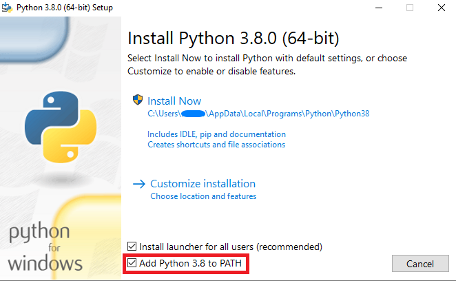

# Instruções para Instalação do Python e do interpretador recomendado

Este documento fornece um guia passo a passo para a instalação do Python e do Visual Studio Code (VS Code) como ambiente
de desenvolvimento para o minicurso "Introdução ao Python para Biomecânica".

Importante destacar que exista uma série de interpretadores, porém o VsCode acaba por ser o mais leve e intuitivo para
novos usuários, desta forma sendo o recomendado nesse momento.

## 1. Instalação do Python

### Passo 1: Baixar o Instalador do Python

1. Acesse o site oficial do Python: [https://www.python.org/downloads/](https://www.python.org/downloads/)
2. Clique no botão "Download Python 3.x.x" (a versão mais recente recomendada estará em destaque).

### Passo 2: Executar o Instalador

1. Após o download, execute o instalador do Python.
2. **IMPORTANTE:** Marque a opção "Add Python to PATH" na parte inferior da janela de instalação.



### Passo 3: Verificar a Instalação

1. Abra o terminal pressionando ```windowns + R``` e digite ```cmd```.
2. Digite o seguinte comando e pressione Enter:
   ```bash
   python --version
   ```
3. Se a instalação foi bem-sucedida, a versão do Python instalada será exibida.

## 2. Instalação do Visual Studio Code (VS Code)

### Passo 1: Baixar o Instalador do VS Code

1. Acesse o site oficial do Visual Studio Code: [https://code.visualstudio.com/](https://code.visualstudio.com/)
2. Clique em "Download for Windows"

### Passo 2: Executar o Instalador

1. Após o download, execute o instalador do VS Code.
2. Aceite os termos de licença e escolha a opção de instalação desejada.
3. **Sugestão:** Marque a opção "Add to PATH" durante a instalação para facilitar o acesso ao VS Code pelo terminal.

### Passo 3: Configurar o Python no VS Code

1. Abra o VS Code após a instalação.
2. Instale a extensão Python para o VS Code:
    - Clique no ícone de extensões no lado esquerdo (ou use o atalho `Ctrl+Shift+X`).
    - Procure por "Python" e instale a extensão desenvolvida pela Microsoft.
3. Configure o interpretador Python:
    - Abra qualquer arquivo `.py` no VS Code.
    - Um pop-up perguntará qual interpretador usar. Selecione o Python instalado anteriormente.

### Passo 4: Verificar a Configuração

1. Crie um novo arquivo `test.py` no VS Code e adicione o código:
   ```python
   print("Hello, Python!")
   ```
2. Execute o código clicando no botão ► posicionado na parte superior direita do VsCode.
3. Se o Python estiver configurado corretamente, a mensagem "Hello, Python!" aparecerá no terminal do VS Code.